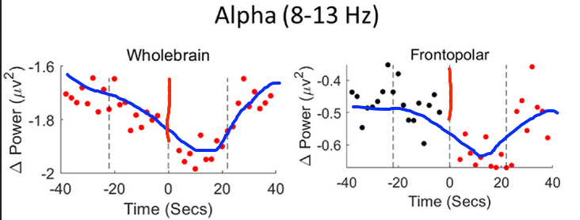
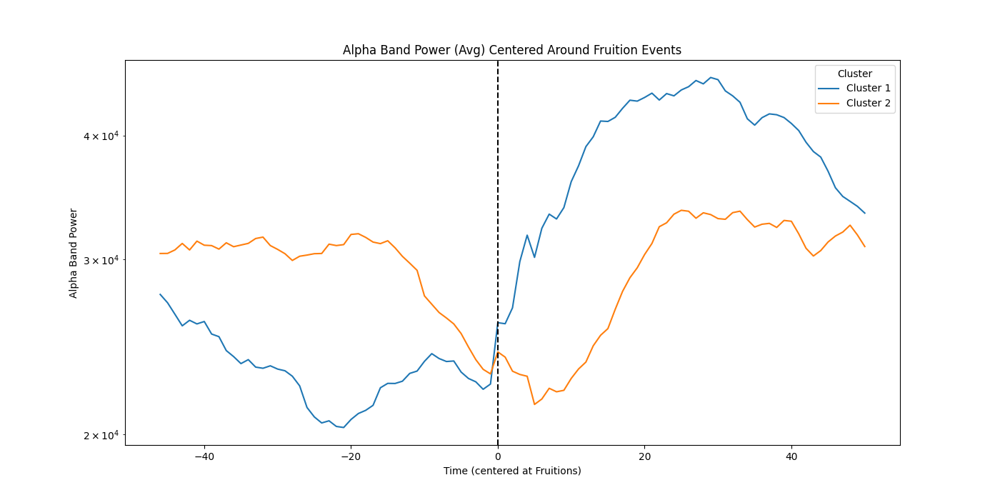
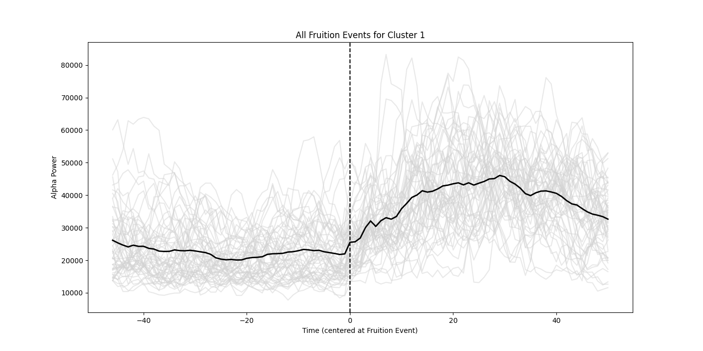
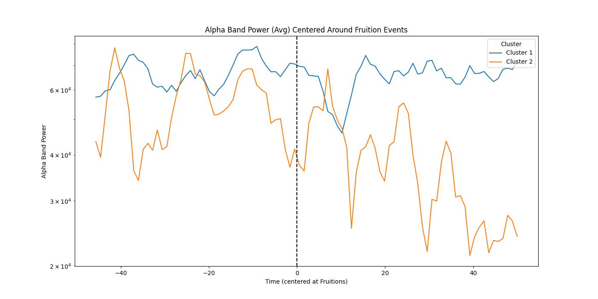

[](http://creativecommons.org/licenses/by-nc-sa/4.0/)

# Fire Kasina "Fruition" analysis using python
Explore the neurology of meditation "Fruitions" through EEG data analysis and visualization, using Daniel Ingram's extensive personal recordings

## 🚀 Quick Navigation
- [Features](#features)
- [Results](#results)
- [Installation](#installation-and-usage)

## Research Citations

- Chowdhury et al. 2023 - [Investigation of advanced mindfulness meditation “cessation” experiences using EEG spectral analysis in an intensively sampled case study](https://www.sciencedirect.com/science/article/abs/pii/S0028393223002282?via%3Dihub)


## 🧘‍️About the Project
Daniel Ingram, a seasoned meditator, has generously [shared](https://osf.io/srfnz/?view_only=1a408d6b96a6402bbf1464418ec3219e) his EEG recordings during Fire Kasina practice, offering a rich dataset encompassing 127 Fruition events and detailed subjective descriptions. This repository replicates and extends the findings from a recent study by ([Chowdhury et al., 2023](https://www.sciencedirect.com/science/article/abs/pii/S0028393223002282?via%3Dihub)), which reported notable shifts in Alpha band power before and after Fruition events, using a previous dataset provided by Daniel. This new dataset is much larger and contains much better subjective tagging, allowing for deeper and more confident analysis. The same trends identified by Chowdhury et al. appear in this data, and are relatively easy for anyone to replicate themselves using Python. Beyond confirming these prior results, this larger dataset reveals new patterns around Fruition events not noticed before. Using Kmeans clustering, at least two distinct types of Alpha power behavior emerge in the time windows before and after Fruitions. This suggests interesting new questions to study in future research. Daniel and I hope that this data and code will empower others to perform their own analysis.

## Note on Terminology
"Fruition" events are the main focus of this analysis, which are also called "Cessations" in the Chowdhury study. In the context of this work and Chowdhury's paper, these two words mean the same thing: an interesting state of consciousness which sometimes occurs in the Therevadan meditation path. Fruitions are not the "goal" of Buddhism or even of Therevadan Buddhism in particular, they are a phenomena which some encounter during meditation which has traditionally been recognized as the culmination of certain sequences of events during practice. Fruitions as a kind of Cessation should also not be mistaken for "Nirodha", a categorically different experience which is also often confusingly described as a "cessation" (and is the topic of other recent research using EEG). For the purpose of this project I will exclusively use the word "Fruition".

## Features
- **Event Sample Size**: Daniel's new dataset contains 127 fruition events so far transcribed from the video logs. These events were determined by Daniel according to his subjective interpretation and should not be interpreted as a perfect record of this neurological event. Daniel also included much more commentary explaining the type of fruition (e.g., 'no-self') and other phenomenological descriptions which may prove useful for other types of analysis. Chowdhury et al. used 37 fruition events for their study from a previous dataset.
  
- **Pre-Processing Provided**: Alpha band powers for each second have been provided for each recorded session. Preprocessing was performed with the Python library MNE.

- **Types of Recordings**: Muse vs Cognionics. The Muse data is provided with the hope of validating this hardware against the Cognionics, and also to hopefully show how other meditators with a Muse can use it to measure similar Fruition events. After some preliminary analysis showed that fruition events may have the most significant power changes in Occipital regions (back of the head), Daniel recorded a couple meditations wearing the Muse backwards, allowing for the two middle sensors to pick up Occipital signals. The data quality looks good but has not yet been explored.

- **Control Data**: Fruition events are always accompanied by a few second of strong face movement which are well known to cause lots of EEG noise. Daniel provided an EEG file where he pretends to have fruitions, making the same face movements as during a real fruition, and speaking afterwards. The same python code for plotting fruition events can be used on this control data, revealing no significant change in Alpha power (for selected electrodes) immediately around fruition events. Gamma and Delta power do show similar behavior, suggesting that these bands are not suitable for this analysis. Non-fruition control data can be pulled at random from other windows in the raw data (however, a word of caution that fruition-like events can happen in other non-fruition circumstances, so this type of control group should be chosen carefully).

## Pre-Processing
Raw EEG data was processed into alpha band power, averaged over 1 second, for each meditation session. Timestamped notes, transcribed from Daniel's video logs, were aligned with this second-averaged data. Fruition tagging required extra processing. Daniel tags fruitions verbally, but waits for around ten to twenty seconds after the event itself, to avoid adding extra noise to the signal from speaking. However, Daniel's fruitions always trigger an involuntary face muscle tension (these events seem like going down the hill of a rollercoaster). This muscle tension is quick and intense, appearing only on the front sensors (Fp1 and Fp2), making it a perfect tag for the exact Fruition moment (Chowdhury et al. also used this to mark fruitions). This tension could cause EEG artifacts, but following Chowdhury's lead, this code ignores the front sensors where the artifacts are worse, and takes an extra step to plot the Alpha power around fake fruitions where Daniel intentionally squints and speaks. It appears that this tension does not cause significant problems for the analysis.

## Results

Alpha power reliably changes in the seconds before and after Fruitions. Chowdhury et al. reported a consistent increase of Alpha power in the 40 seconds before Fruitions, a decrease immediately afterward, and a gradual return to the original power in the following 40 seconds, as shown below. For clarity I've added blue lines to emphasize the linear trends they describe in the study, and a vertical red line to highlight the fruition moments (all the charts below show fruition events at 'zero'):



The new dataset from Daniel appears to have this same behavior, but only for some Fruitions. The graph below plots two distinct behaviors of Alpha power around Fruitions. Cluster 1 behaves identically to the result study results, with an increase followed by a decrease then a recovery. A second distinct behavior (Cluster 2) starts out with low Alpha power then dramatically increases afterward. Both behaviors show reliable increases in Alpha power following Fruitions.



Focusing just on Cluster 2, which shows the most dramatic changes, this graph plots every fruition together with the averaged line, which demonstrates how consistent this behavior is across many fruitions:



These changes are not apparent in the control group (fake 'Fruitions' where Daniel squints and talks just like he does in real Fruitions). Alpha power does change dramatically around these fake events, but not in a consistent way, leading to flat averaged values. Some fake events show decreased Alpha power in the 40 seconds afterwards:



However, there is another control category which isn't mentioned: the dramatic increases in Alpha band power seen around fruitions also occurs frequently elsewhere in the meditation sessions - not around muscle movement or talking, but from some other cause that hasn't been explored yet.


## Analysis
Besides confirming the results from Chowdhury et al., new behavior was noticed in this data not present in their study: there appears to be two different types of Alpha power behavior (as recognized through clustering). One behavior matches the study report perfectly, with a drop of Alpha power during fruitions, then a return to previous power afterwards. Clustering revealed a different general behavior where Alpha power begins low and increases dramatically after fruitions. This python code below performs this clustering (Kmeans) automatically after the first plot, then plots the averaged data for each cluster separately for review. These results are intruiging, but could also risk over-fitting.

It would not be surprising to measure different categories of fruition behavior. One possible explaination is that Fruitions appear in four distinct phenomenological categories. Another possibility is that a fruition event which happen days into a long retreat may look neurologically different than a fruition which occurs during a shorter meditation period. Long retreat participants often describe a 'deepening' which occurs over time during the retreat. Is it possible that this meditation momentum built up over days of constant practice reduces the initial Alpha band power which occurs before a Fruition? This would change the mechanism of how Fruitions act in the brain which Chowdury et al. propose.

## Installation and Usage
All the graphs mentioned in this README can be reproduced immediately by simply running the python code found in the repository. The Alpha band powers for each day are already pre-processed and included in the "Band Data" folders. Python code for rebuilding this band power analysis is also provided and easy to use.

```bash
# Install dependencies (includes MNE for rebuilding the band power files)
pip3 install pandas matplotlib numpy scikit-learn

# Run the final analysis, averaging every fruition event on the same plot:
python3 Plot_Fruition_Band_Comparison.py 'Band Data - Meditations'

# Run the same analysis on the control data ('fake' fruitions where Daniel moves his face muscles and speaks just like during real fruition events):
python3 Plot_Fruition_Band_Comparison.py 'Band Data - Control'

# If you want to rebuild the Alpha band power levels from the .EEG files, run this below (you will need to download the folder from OSF which has the EEG data), after installing the MNE library:
pip3 install mne
python3 Process_Alpha_Data.py <Path to EEG data>

```

If you just want to load the EEG data yourself, I recommend the MNE Python library, which is designed to work with the .EEG data type and offers basically any type of analysis you might want to do:

```python
raw = mne.io.read_raw_brainvision(vhdr_file_path, preload=True)
raw.set_eeg_reference(ref_channels=['A2'])

```

## Next Steps

While these results are intruiging and appear to be reliable, Alpha band power changes are not a definitive marker for Fruition events. This observed Alpha power behavior (significant increase after events, occasional drops before events) occurs many times during each recorded EEG session, including times which are not tagged 'Fruitions' by Daniel. One possibility is that the fruition effect can occur in other times during meditation, perhaps observed by Daniel with different phenomenology. Perhaps the more likely possibility is that this Alpha band behavior is not a reliable indicator of Fruitions, and that the observed behavior around Fruitions has another explaination - perhaps not noise from facial movements, but perhaps some other trigger. 

My personal work will probably involve applying this signal analysis to the Muse data, then incorporating it into a custom Android app which performs this analysis on live data, with an audio feedback system which indicates when the probability of a fruition event reaches a certain threshold. This will allow for users to experiment with triggering false positives themselves through movement or some other trigger, and it could also reveal to users certain unnoticed aspects of their own meditation practice - that has the potential to be extremely valuable to many people.


## Contribution
This work is just a first step, looking at the simplest possible changes around fruitions. The purpose of publishing this data so far is to support future work. I am eager to find others with coding experience who would like to collaborate - no meditation experience necessary. There is a lot of work to do and a large potential to benefit others.

1. Fork the Project
2. Create your Feature Branch (`git checkout -b feature/YourFeature`)
3. Commit your Changes (`git commit -m 'Add some YourFeature'`)
4. Push to the Branch (`git push origin feature/YourFeature`)
5. Open a Pull Request

## License

This project is licensed under the CC BY-NC-SA 4.0 License - see the [LICENSE](LICENSE) file for details.

